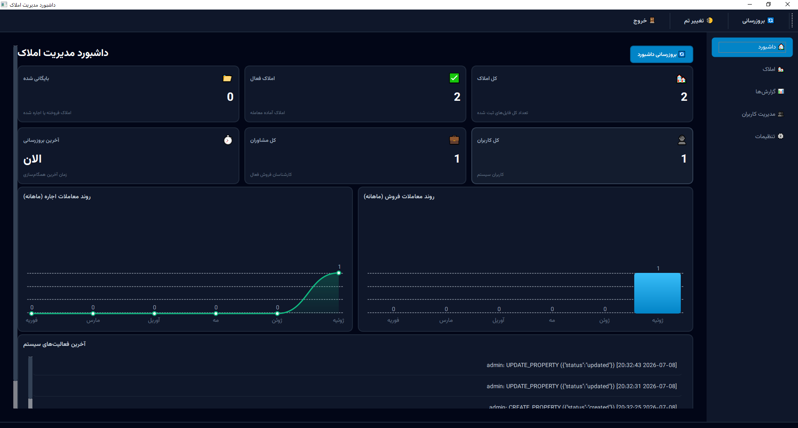
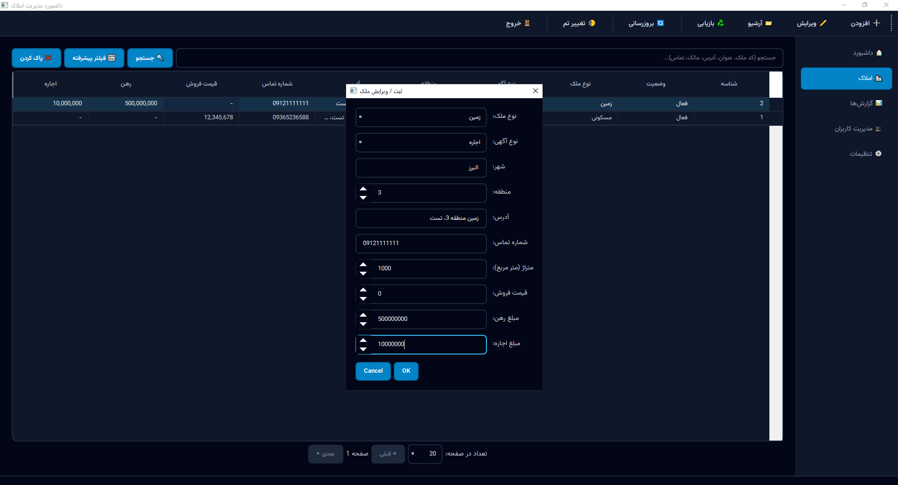
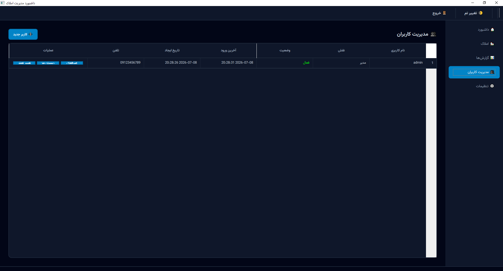
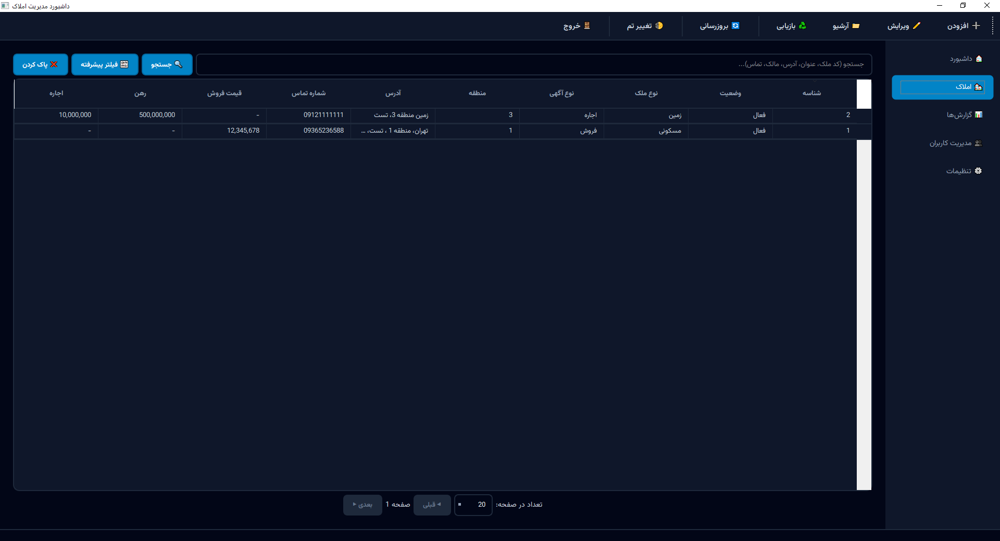
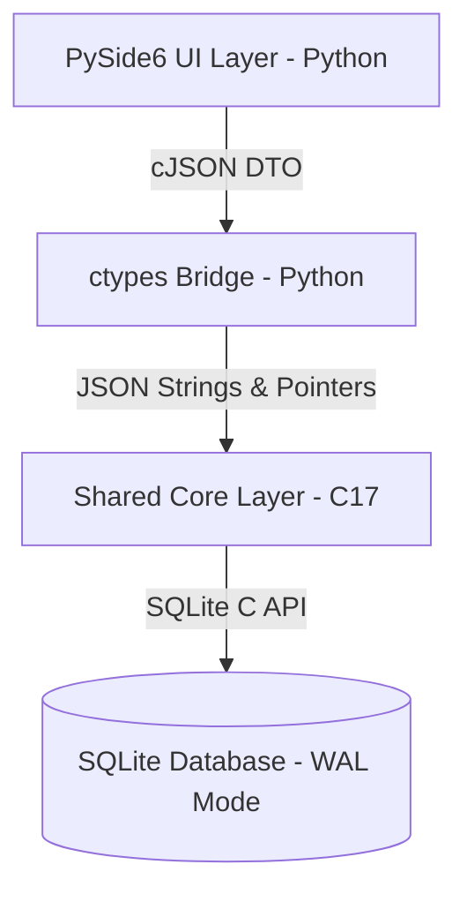

# Real Estate Management System (REMS)

[](https://en.cppreference.com/w/c/17)
[](https://www.python.org/)
[](https://wiki.qt.io/Qt_for_Python)
[](https://www.sqlite.org/)
[](https://cmake.org/)
[](https://www.microsoft.com/windows)
[](LICENSE.md)
[](#)

A professional, high-performance, and secure offline desktop application for managing real estate agencies. Real Estate Management System (REMS) combines a blazing-fast C17 database core with an elegant, responsive PySide6 user interface. Engineered with enterprise-grade Security, Role-Based Access Control (RBAC), and 100% database-driven interactive dashboards.

---

## 📷 Gallery

| **Dashboard Page & Interactive Charts** | **Real Estate Properties Catalog** |
|:---:|:---:|
|  |  |
| **Enterprise User Management** | **Advanced Reporting & Exports** |
|  |  |

---

## 🔍 Overview

### Core Mission
Traditional real estate software is often bloated, reliant on insecure cloud backends, and slow. REMS provides a locally-managed, production-grade desktop application that guarantees data confidentiality, offline reliability, and sub-millisecond execution times even when processing hundreds of thousands of property files.

### Solved Problems
* **Security & Roles:** Standardizes role privileges so agents cannot view audit trails, edit settings, or drop tables, while preventing administrators from accidentally deleting the system's last administrator.
* **Performance Bottlenecks:** Uses native C compilation and highly-optimized SQLite composite indices to process up to 100,000 properties in under 10 milliseconds.
* **Corrupt Restores:** Implements sidecar `.json` integrity validation check loops to ensure database backups are compatible and non-corrupt before restoration.

---

## 🏗 System Architecture

REMS utilizes a modular, multi-layered architecture designed to separate system core, communication wrappers, and the user interface.



### 1. Core Engine (`re_core.dll` - C17)
The system core is compiled into a high-performance DLL. It implements:
* Direct SQLite database connections with autocommit transaction blocks.
* Automatic retry loops with backoff periods (100ms, 200ms, 400ms) for handling locked databases (`SQLITE_BUSY`).
* Argon2-based cryptographic password hashing and memory-scrubbing parameters.
* Strict input validation bounds and schema sanity checks.

### 2. Python Bridge Layer (`re_bridge` - Python ctypes)
A ctypes wrapper translating Python objects into memory pointers and JSON payloads suitable for C consumption. 
* Encapsulates low-level memory allocation and pointer tracking.
* Restricts system exceptions and returns clean, structured error codes (`-1` to `-15`) instead of raw stack traces.

### 3. Application UI Layer (PySide6 - Qt)
A modern, dark-themed GUI designed with:
* Native Right-to-Left (RTL) layout support and Outfit/Inter typeface fonts.
* Real-time field validation highlighting (invalid fields outline in red with lurch warnings).
* Dynamic, interactive, and hover-aware Qt charts representing monthly trends.

---

## ✨ Features

* **Property Portfolio Management:** Create, update, view, archive, and restore properties (residential, commercial, land).
* **Multi-Factor Input Sanitization:** Automatic whitespace trimming and strict bounds check validators in both client and core.
* **Enterprise RBAC:** Granular 16-tier permission system mapping to dynamic roles.
* **Rolling Session Manager:** Rolling 30-minute token lifetimes with automated logout upon inactivity.
* **Interactive Dashboard:** Dynamic charts with cursor tracking, glow highlights, and native tooltips showing monthly trends.
* **Advanced Search & Filtering:** Filter properties by category, listing type, municipal district, area range, price range, and city.
* **Reporting & Document Export:** Download compiled PDF reports (via ReportLab) and Excel sheets (via XlsxWriter) directly.
* **Secure Versioned Backups:** Multi-tier backups accompanied by a sidecar metadata JSON verifying version compatibility on restore.
* **System Audit Trails:** Automatic logging of logins, settings adjustments, backup operations, and status changes.

---

## 🛠 Technology Stack

| Component | Technology | Description |
|:---|:---|:---|
| **Core Layer** | C17 (GCC / MSVC) | Native, highly-optimized DLL core. |
| **User Interface** | Python 3.10+ / PySide6 | Cross-platform Qt framework interface. |
| **Database** | SQLite3 | Embedded database running in Write-Ahead Log (WAL) mode. |
| **JSON Parser** | cJSON | Ultra-lightweight parser inside the C core. |
| **Bridges** | ctypes | Dynamic foreign function loader in Python. |
| **PDF Renderer**| ReportLab | Formatted PDF exporter with Persian typography support. |
| **Excel Exporter**| XlsxWriter | Advanced tabular Excel sheet compiler. |
| **Build System** | CMake 3.20+ / Ninja | Native multi-platform build runner. |

---

## 📂 Project Structure

```
.
├── app/                  # PySide6 Desktop Application
│   ├── assets/           # Typography, icons, and theme files
│   ├── tests/            # PyTest integration and UI verification suites
│   ├── ui/               # Main layout files, widgets, and dialog views
│   └── main.py           # Application starter script
├── bridge/               # Python-C ctypes bridging wrapper
│   └── re_bridge/        # Wrappers, loaders, and model definitions
├── core/                 # Core engine in C17
│   ├── include/          # Service headers and API definitions
│   ├── migrations/       # Database SQL schema migration files
│   ├── src/              # Logic implementations (Auth, Properties, Database)
│   └── CMakeLists.txt    # Compilation settings
├── docs/                 # Architecture Decision Records (ADRs) and specs
├── scripts/              # Build scripts and helper automation tasks
├── settings.json         # Local client config
└── README.md             # Project documentation
```

---

## 🔒 Security Specifications

* **Dynamic Password Hashing:** Utilizes secure Argon2 algorithms inside the core layer.
* **Memory Scrubbing:** Critical fields (such as plaintext passwords) are overwritten with zeros (`memset`) in memory immediately after processing.
* **SQL Injection Shield:** All queries execute through prepared statements with bound parameters (`sqlite3_prepare_v2`).
* **Session Timeout:** Sessions enforce a rolling 30-minute inactivity limit and automatically log out inactive users.
* **Single Session Policy:** Logging in on a new device terminates all older active sessions for that user.
* **Lockout Safe Guards:** Temporary user lockout (5 minutes) after 5 successive invalid login attempts.

---

## ⚡ Performance Optimization Benchmarks

REMS database indices, pagination queries, and count aggregations have been heavily optimized. Below are benchmark statistics run on 100,000 property entries:

| Properties Volume | Search Page 1 (20 items) | Filtered Search (Offset 1,000) | Dashboard Stats Fetch | Seeding Time |
|:---:|:---:|:---:|:---:|:---:|
| **10,000** | 0.97 ms | 4.01 ms | 3.02 ms | 0.21 sec |
| **50,000** | 7.76 ms | 9.00 ms | 19.00 ms | 1.31 sec |
| **100,000** | 6.59 ms | 26.00 ms | 42.00 ms | 2.35 sec |

*Even at **100,000 property entries**, dashboard statistics, search queries, and pagination execute well under **50 milliseconds**.*

---

## 🗄 Database Migrations

SQLite migration files are automatically loaded and executed sequentially by C Core in ascending order:

1. **`0001_initial.sql`:** Creates initial tables (`users`, `properties`, `audit_logs`).
2. **`0002_report_views.sql`:** Sets up database helper views (`vw_active_properties`, `vw_sales_summary`, `vw_agent_statistics`).
3. **`0003_add_search_indices.sql`:** Sets up index parameters for rapid search filtering.
4. **`0004_rbac.sql`:** Migrates system to Enterprise dynamic roles, session tables, and user locks.
5. **`0005_hardening.sql`:** Adds composite performance indices to optimize pagination and sorting.

---

## 👥 User Roles & Permissions

REMS supports dynamic roles configured in the database:

| Feature/Permission | Admin Role (`admin`) | Agent Role (`user`) | Description |
|:---:|:---:|:---:|:---|
| **`VIEW_PROPERTIES`** | Yes | Yes | Search, filter, and view property details. |
| **`CREATE_PROPERTY`** | Yes | Yes | Register new real estate properties. |
| **`EDIT_PROPERTY`** | Yes | Yes | Modify existing property profiles. |
| **`ARCHIVE_PROPERTY`** | Yes | Yes | Soft-delete a property (archive). |
| **`DELETE_PROPERTY`** | Yes | No | Hard-delete a property from the database. |
| **`RESTORE_PROPERTY`**| Yes | No | Restore archived properties back to the active catalog. |
| **`VIEW_REPORTS`** | Yes | No | View statistics, activity charts, and audit logs. |
| **`MANAGE_USERS`** | Yes | No | Add, disable, enable, or reset passwords of other users. |
| **`BACKUP_DATABASE`** | Yes | No | Export database backups with JSON metadata verification. |

---

## 💻 Screenshots Overview

1. **Dashboard & Charts:** Represents overall property counts, active/archived counts, recent audit activities, and monthly sales/rents trend lines with dynamic hover details.
2. **Properties Catalog:** Searchable table with dynamic sorting, multiple pagination rows, and soft-delete/editing controls.
3. **User Management:** Secure registry for admins to review accounts, toggle user active status, reset credentials, and switch permissions.
4. **Reports Section:** Tab for filtering metrics and generating professional PDF/Excel sheets.

---

## 🗺 Roadmap Timeline

```
Phase 1: Repo Setup ──> Phase 2: DB Setup ──> Phase 3: Auth Logic ──> Phase 4: Python Bridge
                                                                                │
Phase 8: Polish ──> Phase 7: Packaging ──> Phase 6: UI CRUD ──> Phase 5: UI Engine
  │
Phase 9: Themes ──> Phase 10: RTL Adjust ──> Phase 11: Timeout Logs ──> Phase 12: Integrity
                                                                                │
Phase 15: Modern Docs <── Phase 14: Dead Code <── Phase 13: Enterprise RBAC <───┘
```

* **Phases 1-4:** Core initialization, library binding, and SQLite database migration wrappers.
* **Phases 5-8:** Main application UI, charts implementation, and Excel/PDF report compilers.
* **Phases 9-12:** Localization checks, session logouts, file backup checksum checks, and busy retries.
* **Phases 13-15:** Dynamic RBAC integration, C/Python code cleanups, performance test validations, and README modernisation.

---

## ⚙ Installation & Setup

### Prerequisites
* **Python 3.10+** (with pip)
* **CMake 3.20+**
* **MSYS2 (MinGW-w64)** or **MSVC 2022** C compiler
* **Ninja Build** (optional, recommended for fast builds)

### 1. Clone & Set Up Python Environment
```powershell
# Clone the repository
git clone https://github.com/Pezhm4n/Property_program_project.git
cd Property_program_project

# Create a virtual environment and activate it
python -m venv venv
venv\Scripts\activate

# Install Python requirements
pip install -r requirements.txt
```

### 2. Build the C Core DLL
```powershell
cd core
mkdir build
cd build

# Generate build files (using MinGW Makefiles)
cmake -G "MinGW Makefiles" -DCMAKE_BUILD_TYPE=Release ..

# Compile the library
cmake --build . --config Release
```
This generates `re_core.dll` inside `core/build/`.

### 3. Run the Application
Navigate back to the project root directory and run the main entry point:
```powershell
cd ..\..
python app/main.py
```

---

## 🧪 Testing

To run the automated validation tests, execute pytest:
```powershell
pytest app/tests/
```
All 21 automated integration tests verify:
* Input validation rules (correct phone/national ID/username rejection).
* Authorization locks and session expirations.
* Property CRUD database operations.

---

## 📄 License
This project is licensed under the MIT License - see the [LICENSE.md](LICENSE.md) file for details.

---

## 👤 Author
* **Pezhman**
* GitHub Profile: [@Pezhm4n](https://github.com/Pezhm4n)
* Repository Link: [REMS Repository](https://github.com/Pezhm4n/Property_program_project)
