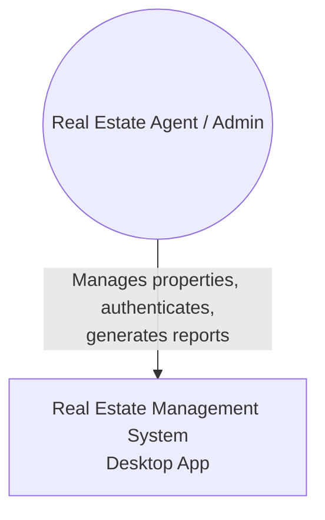
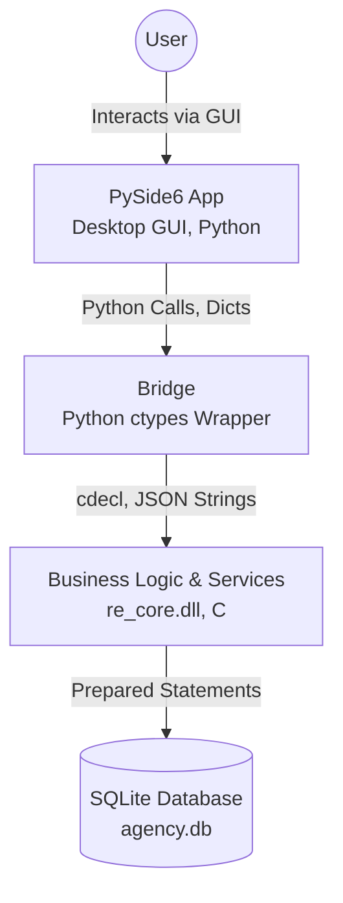
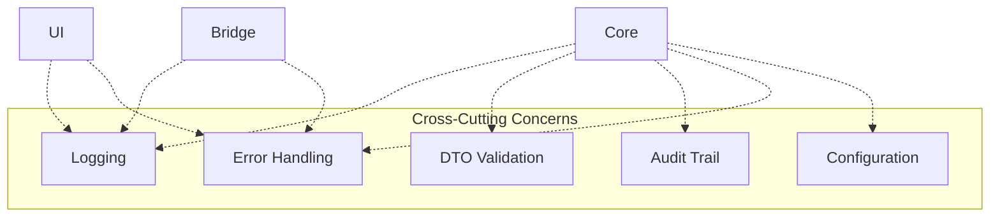
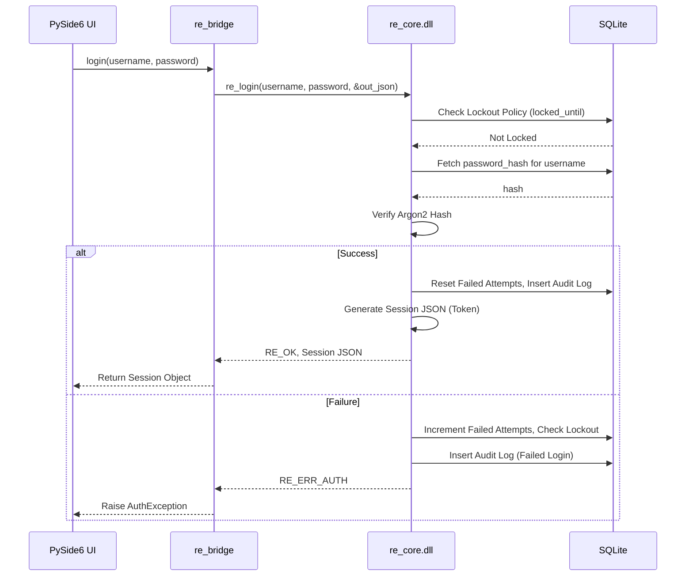
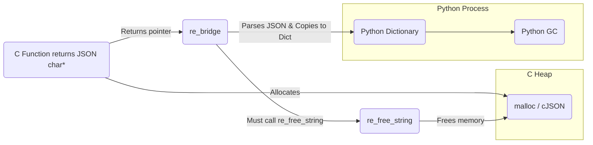

# ARCHITECTURE DESIGN

این سند به تشریح معماری چندلایه پروژه، قوانین وابستگی، مسائل امنیتی، جریان داده‌ها و مدیریت خطاها می‌پردازد.

## 1. قوانین وابستگی مجاز (Allowed Dependencies & Dependency Rule)
سیستم از یک معماری چندلایه اکید (Strict Layered Architecture) پیروی می‌کند و وابستگی‌ها فقط در یک جهت رو به پایین مجاز هستند:

- **UI Layer (PySide6)** `imports` ➔ **Bridge Layer (ctypes wrapper)**
- **Bridge Layer** `calls` ➔ **Service Layer (C Core API)**
- **Service Layer** `uses` ➔ **Repository Layer (Data Access)**
- **Repository Layer** `executes` ➔ **SQLite**

**❌ وابستگی‌های کاملاً ممنوعه (Forbidden Dependencies):**
- UI ➔ SQLite (نقض امنیت، MVC و دور زدن Business Rules)
- UI ➔ Repository (دور زدن Business Rules)
- Bridge ➔ SQLite (نشت منطق پایگاه داده به لایه واسط)
- Repository ➔ Service (نقض اصل Dependency Inversion و ایجاد حلقه)

---

## 2. API Contract & ABI Convention

قرارداد ارتباطی بین Python و لایه C (DLL) با قوانین سخت‌گیرانه زیر تضمین می‌شود:
- **Ownership (مالکیت پوینترها):** هر `char*` که DLL برای پاسخ (مانند یک رشته JSON) به پایتون می‌فرستد، متعلق به C Heap است. پایتون **موظف است** پس از تبدیل آن به `dict` پایتونی، تابع `re_free_string(ptr)` را برای جلوگیری از نشت حافظه فراخوانی کند.
- **Thread Safety Policy:** لایه C تا حد امکان Stateless و Thread-Safe طراحی می‌شود. دسترسی همزمان به دیتابیس با SQLite WAL Mode مدیریت می‌شود.
- **ABI Versioning / DLL Export Convention:** تمام توابع صادراتی با پیشوند `re_` مشخص شده و با قرارداد `extern "C" __declspec(dllexport)` صادر می‌شوند.
- **Calling Convention:** از استاندارد `cdecl` استفاده می‌شود.
- **Session Lifetime:** نشست‌ها بر پایه توکن/شناسه نشست (Session ID) هستند که در پایتون نگهداری شده و در هر درخواست به لایه C پاس داده می‌شوند تا اعتبار آن‌ها (مثلاً انقضا پس از 30 دقیقه) در C چک شود.

---

## 3. Versioning Strategy
نسخه‌گذاری در ۳ سطح مختلف مدیریت می‌شود:
- `schema_version`: در جدول `schema_migrations` در SQLite نگهداری می‌شود و وظیفه کنترل تغییرات پایگاه داده را دارد.
- `api_version`: در هدر (Root) تمام پیام‌های JSON ارسالی/دریافتی قید می‌شود تا تغییرات Contract مدیریت شود.
- `dll_version`: با فراخوانی تابع `re_get_version()` در زمان بالا آمدن برنامه چک می‌شود تا تطابق UI و Core تأیید شود.

---

## 4. استراتژی مدیریت خطا (Error Strategy)
خطاها در لایه C به صورت کدهای منفی تولید شده و در لایه Bridge پایتون به 4 دسته Exception استراتژیک تقسیم می‌شوند:
1. **User Errors:** خطاهایی نظیر `RE_ERR_VALIDATION` یا `RE_ERR_AUTH`. کاربر مستقیماً پیام متنی دریافت می‌کند.
2. **Recoverable Errors:** خطاهای سیستمی مانند `RE_ERR_FILE` که سیستم می‌تواند بدون دخالت کاربر برای رفع آن‌ها تلاش مجدد (Retry) کند.
3. **Retryable Errors:** مانند `RE_ERR_BUSY` (دیتابیس در حال استفاده است). با کمک `sqlite3_busy_timeout` و Retry در پایتون هندل می‌شود.
4. **Fatal Errors:** خطاهای بحرانی مانند `RE_ERR_CORRUPT` یا `RE_ERR_MEM`. لاگ شده و برنامه جهت جلوگیری از خراب‌شدن دیتابیس به طور امن بسته می‌شود (Graceful Shutdown).

---

## 5. معماری امنیتی (Security Architecture)
- **Authentication Flow:** کاربر رمز را در UI وارد می‌کند -> رمز بدون هیچ پردازشی به صورت خام به Bridge و سپس به DLL می‌رود -> لایه Auth در C رمز را با Argon2id هش و مقایسه می‌کند.
- **Authorization Flow:** در کنار هر ریکوئست، Session Token ارسال می‌شود. لایه Service پیش از اجرای منطق، نقش (Role) کاربر را تأیید می‌کند.
- **Password Policy:** حداقل ۸ کاراکتر ترکیبی، که در لایه C (لایه Validation) فورس می‌شود.
- **Session Policy:** منقضی شدن خودکار نشست پس از ۳۰ دقیقه عدم فعالیت (Idle Timeout).
- **Lockout Policy:** قفل شدن حساب کاربر به مدت ۱۵ دقیقه پس از ۵ تلاش ناموفق پیاپی (ثبت در دیتابیس).
- **Audit Policy:** تمامی لاگین‌ها، تغییرات دیتابیس (INSERT/UPDATE/Soft DELETE) و تلاش‌های دسترسی غیرمجاز در جدول `audit_log` با ذکر `user_id`، `action` و `timestamp` ثبت می‌گردند.

---

## 6. نمودارهای معماری (Architecture Diagrams)

### 6.1 C4 Context Diagram

### 6.2 C4 Container Diagram

### 6.3 Cross Cutting Concerns

### 6.4 Sequence Diagram (Login Flow)

### 6.5 Memory Ownership Diagram

