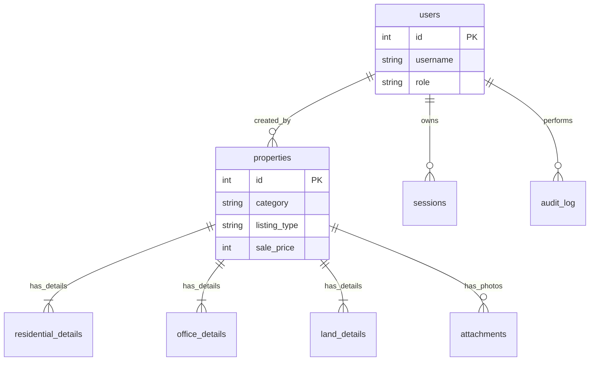
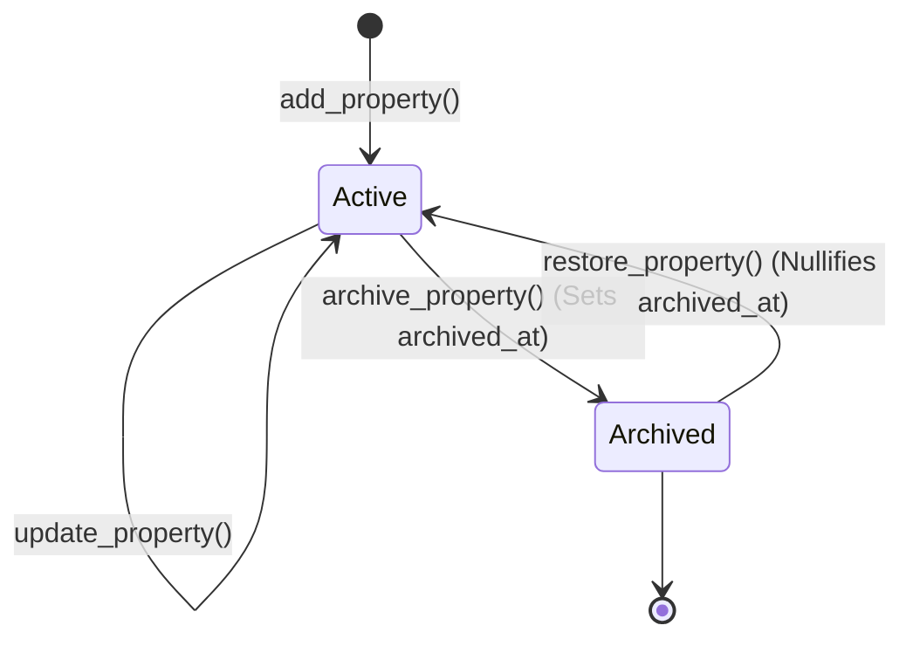
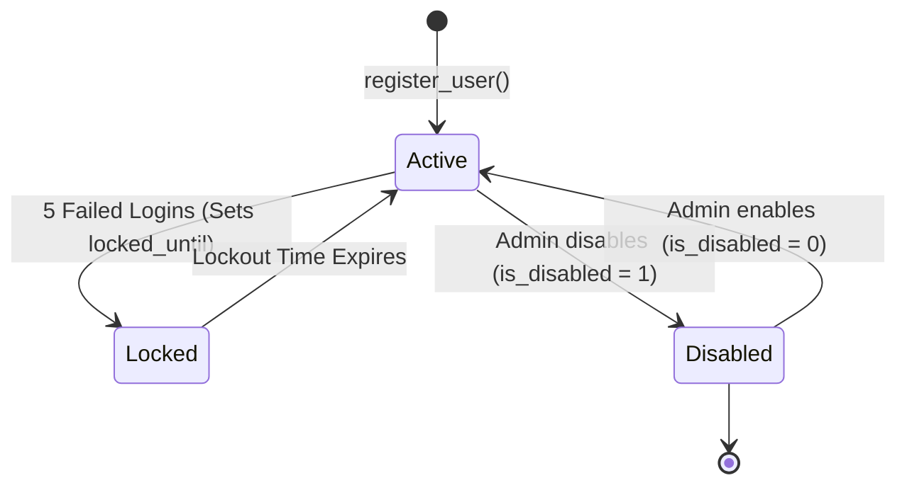

# DATABASE DESIGN (Phase 0.3)

این سند طراحی جامع و دقیق پایگاه داده `SQLite` را در سیستم مدیریت املاک شرح می‌دهد. هدف ایجاد ساختاری با Normalization بالا، رعایت Data Integrity و امکان رهگیری تمامی رخدادها (Auditability) است.

## 1. Naming Convention (قرارداد نام‌گذاری)
برای یکپارچگی پایگاه داده، تمامی نام‌گذاری‌ها از قرارداد زیر پیروی می‌کنند:
- **جداول (Tables):** حالت جمع، `snake_case` (مثال: `users`, `properties`).
- **ستون‌ها (Columns):** `snake_case`.
- **کلید خارجی (FK):** نام مفرد جدول مقصد + `_id` (مثال: `user_id`).
- **ایندکس‌ها (Indexes):** پیشوند `idx_` + نام جدول + نام ستون (مثال: `idx_properties_district`).
- **تریگرها (Triggers):** پیشوند `trg_` + نام جدول + اکشن (مثال: `trg_properties_update_updated_at`).
- **ویوها (Views):** پیشوند `vw_` (مثال: `vw_active_properties`).

---

## 2. استراتژی موجودیت‌های ثابت (Enum Strategy)
در این سیستم، **Source of Truth (منبع واحد حقیقت)** برای Enumها هدرهای زبان **C** هستند.
- در دیتابیس: Enumها به صورت فیلدهای `TEXT` ذخیره شده و با قید `CHECK` در دیتابیس اعتبارسنجی می‌شوند (مثال: `CHECK(category IN ('residential', 'office', 'land'))`).
- در تبادل داده (JSON): مقادیر به صورت String ارسال می‌شوند. لایه `DTO` در زبان C، استرینگ‌ها را به مقادیر `enum` زبان C تبدیل (Map) می‌کند.

---

## 3. طراحی جداول و Data Dictionary

### 3.1 `schema_migrations`
ردیابی نسخه‌های ساختار دیتابیس جهت اجرای اتوماتیک فایل‌های آپدیت (Migration).
- `version` (INTEGER PK): شماره نسخه فایل مایگریشن.
- `name` (TEXT, NOT NULL): نام فایل مایگریشن (مثلاً `0001_initial_tables.sql`).
- `applied_at` (TEXT, NOT NULL): زمان اجرای مایگریشن (ISO8601).
- `checksum` (TEXT, NOT NULL): هش محتوای فایل مایگریشن برای اطمینان از عدم دستکاری.

### 3.2 `settings`
تنظیمات عمومی نرم‌افزار.
- `id` (INTEGER PK)
- `theme` (TEXT): مثلاً `light` یا `dark`.
- `language` (TEXT): پیش‌فرض `fa`.
- `auto_backup` (INTEGER): 1 یا 0.
- `backup_path` (TEXT): مسیر ذخیره بک‌آپ.
- `page_size` (INTEGER): تعداد رکوردهای هر صفحه در جداول.
- `pdf_font` (TEXT): فونت مورد استفاده در گزارشات پی‌دی‌اف.

### 3.3 `users`
نگهداری اطلاعات مشاورین و مدیران.
- `id` (INTEGER PK)
- `username` (TEXT, UNIQUE, NOT NULL): فقط حروف انگلیسی کوچک و اعداد.
- `password_hash` (TEXT, NOT NULL): هش Argon2id.
- `first_name` (TEXT, NOT NULL)
- `last_name` (TEXT, NOT NULL)
- `national_id` (TEXT, UNIQUE, NOT NULL): قید ۱۰ رقمی.
- `phone` (TEXT, NOT NULL): قید شروع با 09 و ۱۱ رقمی.
- `role` (TEXT, NOT NULL): قید فقط `admin` یا `agent`.
- `failed_attempts` (INTEGER): پیش‌فرض 0.
- `locked_until` (TEXT, NULL): زمان پایان قفل شدن کاربر.
- `is_disabled` (INTEGER): پیش‌فرض 0 (Soft Delete برای کاربران).
- `created_at` (TEXT), `updated_at` (TEXT)

### 3.4 `sessions`
مدیریت نشست‌های فعال کاربران.
- `id` (INTEGER PK)
- `user_id` (INTEGER, FK to `users.id`)
- `token_uuid` (TEXT, UNIQUE, NOT NULL): توکن نشست.
- `created_at` (TEXT, NOT NULL)
- `expires_at` (TEXT, NOT NULL): زمان انقضا.
- `revoked_at` (TEXT, NULL): در صورت لاگ‌اوت دستی یا مسدود شدن پر می‌شود.
- `last_activity_at` (TEXT, NOT NULL)
- `client_info` (TEXT): اطلاعات سیستم کلاینت (Machine Name / OS).

### 3.5 `properties`
فیلدهای مشترک تمام املاک.
- `id` (INTEGER PK)
- `category` (TEXT, NOT NULL): `residential`, `office`, `land`.
- `listing_type` (TEXT, NOT NULL): `sale`, `rent`.
- `municipal_district` (INTEGER, NOT NULL)
- `address` (TEXT, NOT NULL)
- `owner_phone` (TEXT, NOT NULL): قید ۱۱ رقمی معتبر.
- `sale_price` (INTEGER, NULL): نامنفی، فقط برای `sale`.
- `rent_deposit` (INTEGER, NULL): ودیعه، فقط برای `rent`.
- `rent_monthly` (INTEGER, NULL): اجاره ماهانه، فقط برای `rent`.
- `created_by` (INTEGER, FK to `users.id`)
- `created_at` (TEXT), `updated_at` (TEXT, NULL)
- `archived_at` (TEXT, NULL): زمان بایگانی ملک.
- `archived_by` (INTEGER, FK to `users.id`, NULL)

### 3.6 جداول ارث‌بری شده (`residential_details`, `office_details`, `land_details`)
همان‌طور که پیش‌تر طراحی شده بود، این جداول رابطه 1:1 با `properties` دارند و شامل فیلدهایی مثل `building_age`, `bedroom_count`, `has_well` و غیره هستند.

### 3.7 `attachments`
ذخیره‌سازی تصاویر یا اسناد مرتبط با ملک.
- `id` (INTEGER PK)
- `property_id` (INTEGER, FK to `properties.id`, ON DELETE CASCADE)
- `file_name` (TEXT, NOT NULL)
- `mime_type` (TEXT, NOT NULL): مثلاً `image/jpeg`.
- `path` (TEXT, NOT NULL): مسیر فایل در سیستم فایل محلی.
- `created_at` (TEXT, NOT NULL)

### 3.8 `audit_log`
جدول Append-Only برای حسابرسی دقیق همه اتفاقات سیستمی.
- `id` (INTEGER PK)
- `actor_id` (INTEGER, FK to `users.id`, NULL): شناسه کاربری که عمل را انجام داد (یا NULL برای کاربر مهمان).
- `action` (TEXT, NOT NULL): نوع عمل (`LOGIN`, `ADD_PROPERTY`, `ARCHIVE_PROPERTY` و...).
- `entity` (TEXT, NOT NULL): موجودیت هدف (`user`, `property`, `setting`).
- `entity_id` (INTEGER, NULL): آیدی موجودیت.
- `old_values_json` (TEXT, NULL): مقادیر قبل از تغییر.
- `new_values_json` (TEXT, NULL): مقادیر پس از تغییر.
- `ip` (TEXT, NULL): آی‌پی کلاینت (برای سیستم‌های لوکال معمولاً 127.0.0.1 است).
- `machine` (TEXT, NULL): نام کامپیوتر.
- `created_at` (TEXT, NOT NULL)

---

## 4. کاتالوگ ویوها (View Catalog)

| نام View | شرح و کاربرد گزارش |
| :--- | :--- |
| `vw_active_properties` | لیست تمام املاک فعال به همراه جزییات (LEFT JOIN تمام جداول ارث‌بری شده) که مبنای جستجوی پیشرفته است. |
| `vw_sales_summary` | محاسبه ارزش کل فروش املاک فعال (فقط لیستینگ‌های فروش). |
| `vw_agent_statistics` | گزارش عملکرد مشاورین (تعداد املاک ثبت شده، آخرین زمان فعالیت). |
| `vw_archived_properties` | لیست تمام املاک بایگانی/فروخته شده جهت گزارشات آماری مدیریتی. |

---

## 5. تریگرها (Triggers)
جهت تضمین یکپارچگی داده‌ها بدون وابستگی به کد C:
- `trg_users_update_updated_at`: بروزرسانی فیلد `updated_at` در `users` پس از هر UPDATE.
- `trg_properties_update_updated_at`: بروزرسانی `updated_at` در `properties`.
- `trg_audit_insert`: (اختیاری) ثبت اتوماتیک در جدول audit هنگام تغییرات حیاتی. ترجیح فعلی این است که Audit در لایه Service به همراه سایر Business Rules ثبت شود.

---

## 6. استراتژی بک‌آپ (Backup Strategy Workflow)
روند گرفتن بک‌آپ از سیستم به گونه‌ای است که خللی در کار سایر کاربران ایجاد نکند:
```text
1. User clicks "Backup" in UI (or Auto-Backup triggers)
   ↓
2. Python Bridge calls `re_backup_database(path)`
   ↓
3. C Core uses `sqlite3_backup_init`, `sqlite3_backup_step`, `sqlite3_backup_finish`
   ↓
4. Saves safely to `backup.db` (even while WAL is active and others are writing)
   ↓
5. C Core (or Python) zips the file to `backup_YYYYMMDD.zip`
   ↓
6. Apply Retention Policy (e.g., delete backups older than 30 days)
```

---

## 7. نمودار ER دیتابیس (Entity-Relationship)


---

## 8. نمودارهای وضعیت (State Diagrams)

### 8.1 State Diagram for Property
وضعیت‌های ممکن برای یک ملک:


### 8.2 State Diagram for User
وضعیت‌های ممکن برای یک کاربر:


---

## 9. Error Mapping (استراتژی تبدیل خطاهای SQLite)
مدیریت خطاهای SQLite در لایه Repository C و ارسال به Python:

| خطای SQLite | تفسیر لایه Repository | کدی که DLL برمی‌گرداند | Python Exception |
| :--- | :--- | :--- | :--- |
| `SQLITE_CONSTRAINT_UNIQUE` | رکورد تکراری (مثال: یوزرنیم تکراری) | `RE_ERR_DUPLICATE` (-4) | `DuplicateRecordException` |
| `SQLITE_CONSTRAINT_CHECK` | دیتای نامعتبر برای ذخیره | `RE_ERR_VALIDATION` (-1) | `ValidationException` |
| `SQLITE_BUSY` / `LOCKED` | دیتابیس در حال استفاده است | `RE_ERR_BUSY` (-10) | `DatabaseBusyException` (Retry) |
| `SQLITE_CORRUPT` | فایل دیتابیس آسیب دیده است | `RE_ERR_CORRUPT` (-11)| `FatalDatabaseException` (Exit) |
| `SQLITE_OK` / `DONE` | موفقیت‌آمیز | `RE_OK` (0) | (No Exception) |
